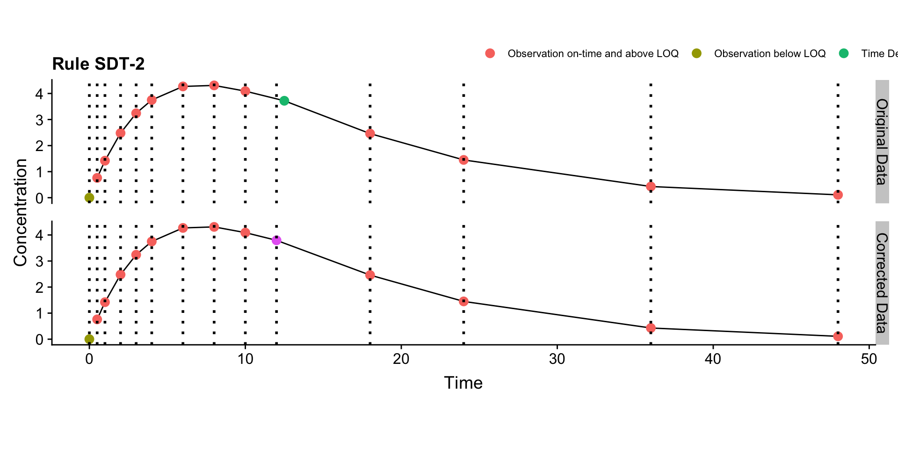

# Deviation Examples


# SDT
## SDT-1

```
## Warning: `panel.margin` is deprecated. Please use `panel.spacing` property
## instead
```


## SDT-2

```
## Warning: `panel.margin` is deprecated. Please use `panel.spacing` property
## instead
```


## SDT-3

```
## Warning: `panel.margin` is deprecated. Please use `panel.spacing` property
## instead
```



# MDT
## MDT-1

```
## Warning: `panel.margin` is deprecated. Please use `panel.spacing` property
## instead
```


## MDT-2

```
## Warning: `panel.margin` is deprecated. Please use `panel.spacing` property
## instead
```


## MDT-3

```
## Warning: `panel.margin` is deprecated. Please use `panel.spacing` property
## instead
```


# SDC
## SDC-1

```
## Warning: `panel.margin` is deprecated. Please use `panel.spacing` property
## instead
```


## SDC-2

```
## Warning: `panel.margin` is deprecated. Please use `panel.spacing` property
## instead
```


## SDC-3

```
## Warning: `panel.margin` is deprecated. Please use `panel.spacing` property
## instead
```


## SDC-4a

```
## Warning: `panel.margin` is deprecated. Please use `panel.spacing` property
## instead
```


## SDC-4b

```
## Warning: `panel.margin` is deprecated. Please use `panel.spacing` property
## instead
```


## SDC-4c

```
## Warning: `panel.margin` is deprecated. Please use `panel.spacing` property
## instead
```


## SDC-4d

```
## Warning: `panel.margin` is deprecated. Please use `panel.spacing` property
## instead
```


# MDC
## MDC-1

```
## Warning: `panel.margin` is deprecated. Please use `panel.spacing` property
## instead
```


## MDC-2

```
## Warning: `panel.margin` is deprecated. Please use `panel.spacing` property
## instead
```


## MDC-3

```
## Warning: `panel.margin` is deprecated. Please use `panel.spacing` property
## instead
```


## MDC-4a

```
## Warning: `panel.margin` is deprecated. Please use `panel.spacing` property
## instead
```


## MDC-4b

```
## Warning: `panel.margin` is deprecated. Please use `panel.spacing` property
## instead
```


## MDC-4c

```
## Warning: `panel.margin` is deprecated. Please use `panel.spacing` property
## instead
```


## MDC-4d

```
## Warning: `panel.margin` is deprecated. Please use `panel.spacing` property
## instead
```


# Session Information


```r
sessionInfo()
```

```
## R version 3.5.1 (2018-07-02)
## Platform: x86_64-apple-darwin15.6.0 (64-bit)
## Running under: macOS High Sierra 10.13.6
## 
## Matrix products: default
## BLAS: /Library/Frameworks/R.framework/Versions/3.5/Resources/lib/libRblas.0.dylib
## LAPACK: /Library/Frameworks/R.framework/Versions/3.5/Resources/lib/libRlapack.dylib
## 
## locale:
## [1] en_US.UTF-8/en_US.UTF-8/en_US.UTF-8/C/en_US.UTF-8/en_US.UTF-8
## 
## attached base packages:
## [1] stats     graphics  grDevices utils     datasets  methods   base     
## 
## other attached packages:
## [1] cowplot_0.9.3 ggplot2_3.0.0 dplyr_0.7.6  
## 
## loaded via a namespace (and not attached):
##  [1] Rcpp_0.12.19     knitr_1.20       bindr_0.1.1      magrittr_1.5    
##  [5] munsell_0.5.0    tidyselect_0.2.5 colorspace_1.3-2 R6_2.3.0        
##  [9] rlang_0.2.2      plyr_1.8.4       stringr_1.3.1    tools_3.5.1     
## [13] grid_3.5.1       gtable_0.2.0     xfun_0.3         withr_2.1.2     
## [17] htmltools_0.3.6  lazyeval_0.2.1   yaml_2.2.0       rprojroot_1.3-2 
## [21] digest_0.6.18    assertthat_0.2.0 tibble_1.4.2     crayon_1.3.4    
## [25] bookdown_0.7     bindrcpp_0.2.2   reshape2_1.4.3   purrr_0.2.5     
## [29] glue_1.3.0       evaluate_0.12    rmarkdown_1.10   labeling_0.3    
## [33] stringi_1.2.4    compiler_3.5.1   pillar_1.3.0     scales_1.0.0    
## [37] backports_1.1.2  pkgconfig_2.0.2
```
